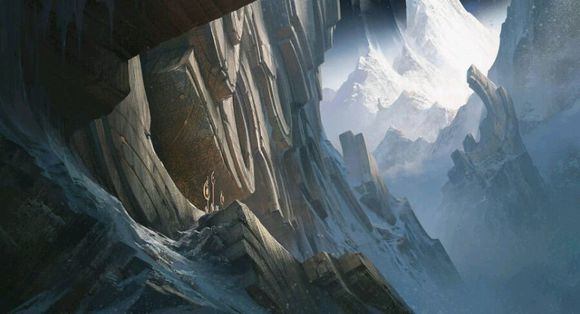
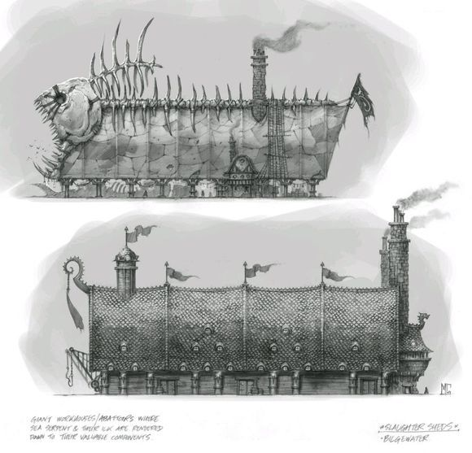
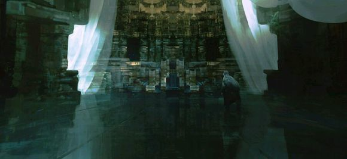
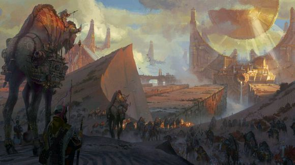

*悬而未决：宏大宇宙设定中的叙事钩子*

我们中的许多人，尤其是我自己，一谈起自己深爱着的东西都是乐此不疲津津乐道的，无论是《英雄联盟》、《星球大战》、《被遗忘的国度》、《战锤 40K》、《魔兽世界》、《哈利波特》、漫威系列或者其他别的作品。上述这些都是非常庞大丰富的宇宙设定，充满了高远的寓意、繁复的历史故事和惹人怜爱 (或者恨之入骨)的人物角色。就我自己而言，当我深深投入其中的时候，真的难以自拔。

(*注：钩子，原文是hook，有以下几层意思：钩子、线索、未完的故事。为了保持原有的信息量所以直译为比较形象的钩子了。)

相信许多人都有同样的感受。

初极狭，才通人。

我觉得，我们之所以如此热爱这些宇宙设定，是因为越是深入挖掘，就越能够发现更多东西。这种沿着羊肠小道不断深入最后豁然开朗的感觉让我们百看不厌。每次我陷入其中，都能看到更多令人抓心挠肝的隐晦钩子，更多历史事件的模糊影子，更多奇异生物的惊鸿一瞥，还有更多背景故事的细枝末节……以星火燎原之势点燃我的想象力。这些宇宙设定都是有机的，里面的故事一直都在演进，随着游戏、漫画、小说、电影、电视剧等作品的推出而向前发展。

有时我们会看到有一些叙事钩子、模糊概念和细枝末节——而你早几年前就已经察觉到了，突然有一天会成为剧情的焦点，那种满足感是不可言喻的。有的时候这些小细节最初只是无心插柳地随口一说，但铁杆粉丝们却会捕风捉影、紧追不放、脑洞大开。当坊间猜测不负众望地被证实为官方正史的时候，他们就会欣喜若狂。 
 

这就好比《星球大战：新的希望》中第一次提到了“克隆人的战争”，而多年以后，在《星球大战：克隆人的战争》中才真正揭晓一切。再比如，《战锤40K》的宇宙中多次提到了“荷鲁斯叛乱”的历史传说，而最后成为一套系列小说的时代背景。

这种令人难以言表的满足感，来自观众与编剧/原作者之间形成的同步和默契 —— 知道笑点在哪里、重点在哪里、究竟暗示了什么梗。就像是在电影的演职员表最后的彩蛋里闪现了一个角色，而你一下就知道角色的身份和出现的意义，而不需要偷偷问旁边的人——“那人谁呀?”

每当这些悬而未决的故事线索被重新拾起并且接续下去时，都会让人感到高兴和满足，但如果一切线索都不留钩子，那么也就没有太多值得我们反复回看的意义了。当然，如果这是一部单线叙事的作品，那么不留钩子也无关紧要 —— 作家/编剧/原作者只会向你透露当前最符合剧情需要的信息。这就好比，如果在《太空堡垒卡拉狄加》第一集就透露谁是塞隆人，那一切紧张和猜疑就都没了;如果在《权力的游戏》里一上来就透露“阿多”的含义，那么第六季第五集的那个场景的震撼力就会大打折扣。 

支线故事

当创作一个多线发展的宇宙设定时，线索的安排方式就有所不同了。所谓多线发展，就是指这个宇宙设定中有无数个故事线索，可以通过不同的形式来讲述(例如游戏、漫画、小说等)，而不是单线发展的剧情(例如有始有终的系列小说)。

这两种概念的实际案例可以参考《哈利波特》(单线发展)和漫威宇宙(多线发展，有时还能全盘推倒重新构想)。我们创作《英雄联盟》的方式很大程度上属于后者。整体创作的目标是世界和角色，而不以单一故事为核心 —— 这就意味着可以有无数个故事线索等待挖掘。可以有更大的剧情事件，将许多不同的角色和地区连接起来(比如漫威宇宙中的无限宝石)，但真正驱动故事前进的，是角色本身。在一个庞大的多线发展的宇宙设定中，留下大量的钩子无疑是一件好。
 

对于编剧来说，现有历史背景中的故事钩子简直是天赐良机——因为可以提供新的叙事脉络。故事钩子可能会让人产生灵感火花，进而演变成许多东西。小至英雄语音，大至短篇故事，而且还能催生出精彩的同人创作，甚至形成一套史诗级长篇小说。

每个引人遐想的细枝末节、叙事钩子、历史碎片都能成为一段新故事的基础。一些钩子和线索可以被扒得水落石出，而另一些惊天秘密则只能通过微妙的细节进行恰到好处的暗示 —— 还有一些钩子和线索出于某种原因永远都不会有结局(这也是可以的，只要别让这些线索在某个角色的故事中占据主导地位)。

对于观众来讲，悬而未决的故事线索和钩子是遐想和猜测的空间，它们预示着即将发生的重大事件，或者暗示着更加深奥丰富的历史背景。它们可以告诉玩家故事以外还有一个更大的世界，有更多的故事等待发掘。最后，观众也可以借此来吐露心声，表达他们喜欢什么样的故事钩子，让创作者更能明确创作重点。
 

然而，最重要的一点就是不能舍本逐末。如果留下了太多故事钩子，但却从来都没有后续的收尾和延续，就会令读者非常失望。这种作品会让人摔书掀桌，而且无论是对读者还是对宇宙设定来说，都会产生负面的影响。人们会觉得一切暗示和线索的背后其实都空无一物，只不过是镜花水月、空中楼阁而已。

所以真正的技巧在于，在留下大量钩子的同时，不能长时间放任不管，必须时不时地收尾 —— 尤其是那些最令人感到千钧一发的线索。如果不负责任地留下太多钩子悬而未决，就会让人觉得这些都是有始无终的烂尾 —— 甚至会让整个世界设定都变得烂尾。没有任何剧情上的进展，也没有任何疑问会得到解答。